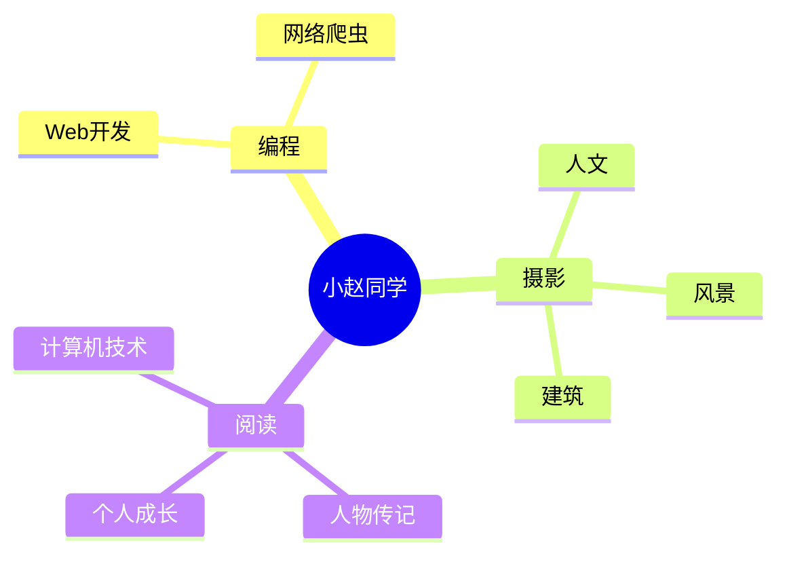

<div align="center">
  
  <!-- dynamic typing effect 动态打字效果 -->
  <div align="center">
    <a href="http://www.wall-e.icu/">
      
    </a>
  </div>

  <!-- knock code pictures 敲代码的图片 -->
  <br>

  <!-- profile logo 个人资料徽标 -->
  <div align="center">
    <!-- <a href="http://www.wall-e.icu/"></a>&emsp; -->
     <!-- 
    <a href="https://twitter.com/sun0225SUN/"></a>&emsp;
    <a href="https://www.youtube.com/@sun0225SUN"></a>&emsp;
    <a href="https://box.sunguoqi.com/weixin_mp"></a>&emsp;
    -->
    <!-- <a href="https://space.bilibili.com/1202114700?spm_id_from=333.999.0.0/"></a>&emsp;
    <a href="https://blog.csdn.net/weixin_63717396?type=blog/"></a>&emsp;
    <a href="https://www.zhihu.com/people/xie-ding-e-de-mao-64-99-5/"></a>&emsp; -->
    <!-- visitor statistics logo 访客数统计徽标 -->
    
  </div>

  <!-- Snake Code Contribution Map 贪吃蛇代码贡献图 -->
<picture>
  <source media="(prefers-color-scheme: dark)" srcset="https://cdn.jsdelivr.net/gh/Lumos-i/Lumos-i/profile-snake-contrib/github-contribution-grid-snake-dark.svg" />
  <source media="(prefers-color-scheme: light)" srcset="https://cdn.jsdelivr.net/gh/Lumos-i/Lumos-i/profile-snake-contrib/github-contribution-grid-snake.svg" />
  
</picture>

</div>

#  🙋 Hello

<table>
<tr><td>

<!-- About me 关于我 -->
### 🤺 About Me


<p>&emsp;&emsp;大家好，我是小赵同学。</p>
<p>&emsp;&emsp;热爱编程、摄影、读书、旅行。</p>
<p>&emsp;&emsp;热爱计算机科学和IT互联网事业，励志成为一名优秀的独立开发者。</p>
<p>&emsp;&emsp;我们正在让这个世界变得更加美好，通过代码的重复使用和延展构建完美体系。</p>
<p><strong>&emsp;&emsp;We're making the world a better place. Through constructing elegant hierarchies for maximum code reuse and extensibility.</strong></p>

</td></tr>


<!-- 
<tr>
<td>
  
### 🏢 Work Experience


- [广州图慧信息科技有限公司](https://www.tuhuimap.com/) &emsp; 📌 2023-06-19 —— Now
  
  - 工作岗位：Web前端开发工程师（初级）
  - 工作内容：GIS相关


- [蔚来汽车科技（安徽）有限公司](https://www.nio.cn/) &emsp; 📌 2023-02-20 —— 2023-05-12
  
  - 工作岗位：Web前端开发实习生
  - 工作内容：参与一站式数据治理与研发平台 DataSight 的开发与维护工作

</td>
</tr>
-->
<tr><td>


<tr><td>

<!-- 
### 📊 WakaTime

<picture>
  <source
    srcset="https://github-readme-stats.vercel.app/api/wakatime?username=Lumos-i&layout=compact&text_color=f0f6fc&bg_color=00000000&hide_border=true&hide_title=true"
    media="(prefers-color-scheme: dark)"
  />
  <source
    srcset="https://github-readme-stats.vercel.app/api/wakatime?username=Lumos-i&layout=compact&text_color=1f2328&bg_color=00000000&hide_border=true&hide_title=true"
    media="(prefers-color-scheme: light), (prefers-color-scheme: no-preference)"
  />
  
</picture>

</td></tr>

<tr><td>
wakatime 统计 -->
<!--START_SECTION:waka-->
**I'm a Night 🦉** 

```text
🌞 Morning                270 commits         █████░░░░░░░░░░░░░░░░░░░░   19.59 % 
🌆 Daytime                413 commits         ███████░░░░░░░░░░░░░░░░░░   29.97 % 
🌃 Evening                497 commits         █████████░░░░░░░░░░░░░░░░   36.07 % 
🌙 Night                  198 commits         ████░░░░░░░░░░░░░░░░░░░░░   14.37 % 
```
📅 **I'm Most Productive on Friday** 

```text
Monday                   204 commits         ████░░░░░░░░░░░░░░░░░░░░░   14.80 % 
Tuesday                  184 commits         ███░░░░░░░░░░░░░░░░░░░░░░   13.35 % 
Wednesday                177 commits         ███░░░░░░░░░░░░░░░░░░░░░░   12.84 % 
Thursday                 143 commits         ███░░░░░░░░░░░░░░░░░░░░░░   10.38 % 
Friday                   346 commits         ██████░░░░░░░░░░░░░░░░░░░   25.11 % 
Saturday                 147 commits         ███░░░░░░░░░░░░░░░░░░░░░░   10.67 % 
Sunday                   177 commits         ███░░░░░░░░░░░░░░░░░░░░░░   12.84 % 
```


📊 **This Week I Spent My Time On** 

```text
🕑︎ Time Zone: Asia/Shanghai

💬 Programming Languages: 
Vue.js                   11 hrs 1 min        █████████░░░░░░░░░░░░░░░░   36.77 % 
Markdown                 9 hrs 50 mins       ████████░░░░░░░░░░░░░░░░░   32.83 % 
HTML                     2 hrs 16 mins       ██░░░░░░░░░░░░░░░░░░░░░░░   07.59 % 
SCSS                     2 hrs 7 mins        ██░░░░░░░░░░░░░░░░░░░░░░░   07.07 % 
JavaScript               1 hr 26 mins        █░░░░░░░░░░░░░░░░░░░░░░░░   04.83 % 

🔥 Editors: 
VS Code                  24 hrs 47 mins      █████████████████████░░░░   82.62 % 
Obsidian                 5 hrs 12 mins       ████░░░░░░░░░░░░░░░░░░░░░   17.38 % 

💻 Operating System: 
Windows                  22 hrs 48 mins      ███████████████████░░░░░░   76.04 % 
Mac                      7 hrs               ██████░░░░░░░░░░░░░░░░░░░   23.34 % 
Linux                    11 mins             ░░░░░░░░░░░░░░░░░░░░░░░░░   00.62 % 
```


 Last Updated on 19/07/2023 02:50:59 UTC
<!--END_SECTION:waka-->
  
</td></tr>
</table>

<!-- ########################################## 分割 ########################################## -->


<div align="center" >



<!-- just img 图片 -->


<!--  skill badge 技能徽章 -->
💪 正在学习


  
🧠 计划学习


🧰 常用的工具


<!-- programming tool icon 编程工具图标 -->
<br>

<!-- svg -->


 


<br>

<!-- gif -->


<!-- 
</div>
just img 图片 -->
<!-- 

profile-3d-contrib 3D贡献图-->
</div>

<!-- ########################################## 分割 ########################################## -->


<div align="center" >

<!-- 
<br>
  Github-Stats-Terminal 终端风格信息 -->
<!-- Quotes 名人名言 -->
<br>
  
<!-- GitHub 奖杯🏆 -->
<br>

<!-- GitHub 数据统计 -->

<br><br>

<!-- 
<a href="https://github.com/Lumos-i/Awesome-Love-Code">
</a>
<a href="https://github.com/sun0225SUN/Student-Data-Vision">
</a><br><br>
 Awesome repo 比较好的仓库--> 
<!-- 
<table>
  <tr>
    <td></td>
    <td></td>
  </tr>
  <tr>
    <td colspan="2"><a href="https://run.sunguoqi.com"></a><br></td>
  </tr>
</table>
Wakatime Graph-->
</div>

<!-- ########################################## 分割 ########################################## -->


<div align="center">

<!-- run 图片 -->


<!-- Joke 笑话 -->
<div></div>

<!-- github-readme-streak-stats 连续提交代码天数记录 -->
&emsp;

&emsp;

<!-- metrics 基础资料 -->
&emsp;

&emsp;

<!-- GitHub Activity Graph GitHub 活动图 -->
<table align="center">
  <tr>
    <td></td>
  </tr>
</table>

</div>

<!-- ########################################## 分割 ########################################## -->


<!-- GitHub metrics 信息指标 -->
<div align="center">

<!-- just img 图片 -->


<!-- 
<table>
  <tr>
    <td></td>
  </tr>
</table>
first form 第一个表格 -->
<!-- 
<table>
  <tr>
    <td></td>
    <td></td>
  </tr>
  <tr>
    <td></td>
    <td></td>
  </tr>
  <tr>
    <td></td>
    <td></td>
  </tr>
  <tr>
    <td></td>
    <td></td>
  </tr>
  <tr>
    <td></td>
    <td></td>
  </tr>
  <tr>
    <td></td>
    <td></td>
  </tr>
</table>
second form 第二个表格 -->


<!-- just img 图片 -->

</div>
